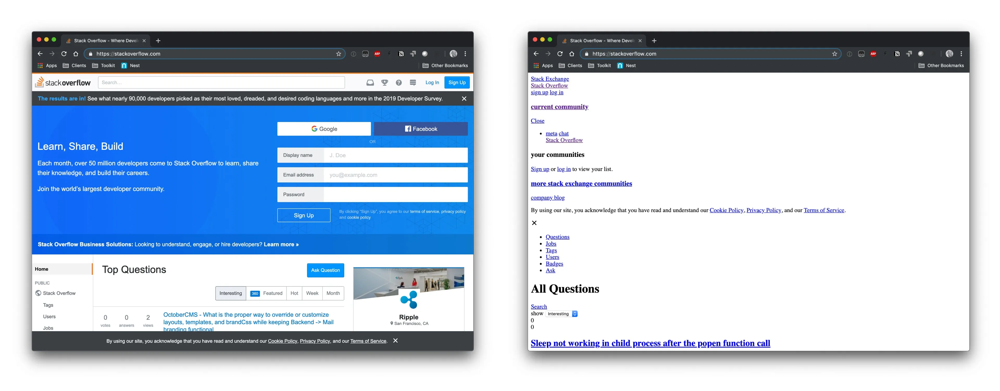

# Workshop HTML / CSS

## _Qu’est-ce que l’HTML ?_

HTML is a markup language used to create web pages.

Setting up an HTML file :

- Creating an index.html file

A tag consists of an opening and closing delimiter:
```sh
<TAG> CONTENTS </TAG>
```
Note that a tag does not necessarily have content and can be unique
```sh
    <TAG>
```
The minimal content of an HTML file:

```sh
<!DOCTYPE>
<html>
    <head>
        <meta charset="utf_8" />
        <title>TITRE</title>
    </head>
    <body>
    </body>
</html>
```

- The ``` <!DOCTYPE> ``` tag is used to indicate the version of the HTML used.
- The ``` <html> / </html> ``` tag will contain all the HTML content of the page.
- The ``` <head> / </head> ``` tag provides general information about the document (e.g. page title, link to CSS file, etc.).
- The ``` <meta ... /> ``` tag is used to place metadata in an HTML document, the charset is used to define the encoding of the page 
- The ``` <title> / </title> ``` tag as its name suggests, contains the title of the page.
- The ``` <body> / </body> ``` tag contains the content of the web page (it is in this tag that we could add other tags to display content on our web page).


It is important to know that tags can nest, in the example above, the ``` <html> ``` tag contains the ``` <head> ``` and ``` <body> ``` tag.<br/>
As for the ``` <head> ``` tag, it contains the ``` <meta> ``` and ``` <title> ``` tag.<br/>
Thus the site is broken down into nestable boxes with their contents.<br/>


Some useful tags:
- Text tag:
```sh
    <h1>Content</h1> to <h6>Content</h6>
    <p>Content</p>
```
- line break:
```sh
    <br>
```
- Bulleted list creation:
```sh
    <ul>
        <li>EPITECH</li>
        <li>E-ARTSUP</li>
        <li>ISEG</li>
    </ul>
```
A tag can be configured, thanks to attributes and an attribute takes a parameter
```sh
<TAG [ATTRIBUTE 1] [ATTRIBUTE 2] > CONTENT</TAG>
```
``` [ATTRIBUT x] => ATTRIBUT_NAME="PARAMETER".```<br/>
The next tags will address this notion.

- Creating a hyperlink to another web page (redirection):
```sh
<a href="site link">Content</a> 
```

- Adding an image:
```sh

```

- Box containing the page header (top part of the page):
```sh
<header></header>: header (top part of the page).
```
_Warning: some sites do not have a header._

- Box containing the footer (bottom part of the page).
```sh
<footer>Content</footer>
```
- Box containing the navigation bar
```sh
<nav>Content</nav>
```
- Creation of a new box:
```sh
<article>Content</article>
<div>Content</div>
```

- Creating a table:
```sh
<table>
    <tr>
            <th>Name</th>
            <th>Favorite Color</th>
    </tr>
    <tr>
            <td>Bob</td>
            <td>Yellow</td>
    </tr>
    <tr>
            <td>Michelle</td>
            <td>Purple</td>
    </tr>
</table>
```


## Exercises:

1. Display a title <br/>
2. Displaying a subtitle <br/>
3. Make a comprehensive list of your 3 favorite dishes in a box ``` <div> ```.<br/>
4. Add an image and its caption <br/>
5. Create a link on the image so that we are redirected to a site consistent with it. <br/>
6. Make a descriptive text under the image and in agreement with it! <br/>
7. Create a footer in which you will display: © followed by the current year and a name. <br/>

<br/>
What is CSS :

CSS is a computer language used to format an HTML file.



CSS can be placed in a separate file with the .css extension.

To link a CSS file to an HTML document, place a unique <link/> tag with a rel=”stylesheet” attribute and href="file link" in the tag <head>

Class and ID:

The id attribute defines an identifier that must be unique in the HTML document (see example below). This allows you to modify a box without modifying boxes with the same tag!

```sh
<div id="exemple"></div>
```

The class attribute allows all boxes with the same class (see example below).


```sh
<div class="bloc"></div>
<div class="bloc"></div>
```

How to make a formatting with the CSS file :

To change the layout of a tag, we write the name of the tag followed by braces.

```sh
body {
    font-size: 20px;
    font-family : 'poiret';
    font-weight: bold;
}
```

Pour modifier la mise en page d’une balise unique (avec un id), on écrit le nom de l’id précédé par un “#” :

```sh
\#bloc_col {
    padding-top: 3em;
    display: bloc;
    max-width: 60%;
    margin: 0 auto
}
```

Pour modifier la mise en page de plusieurs balise (avec une class) on écrit le nom de la class précédé d’un “.” :


Toutes les propriétés présentes entre les accolades (ex: font-size, color, etc.)  permettent de modifier la mise en page de la page web. 

All the proprieties between the braces (e.g. )


How to make a mobile friendly site:

You can add in the head:

<meta name="viewport" content="width=device-width, initial-scale=1.0">

This line will resize the page for the mobile version.

But in general this is not enough, so we can specify in the CSS a specific layout that only applies on mobile:

@media only screen and (max-width: 600px) {
// put here CSS class
} 


